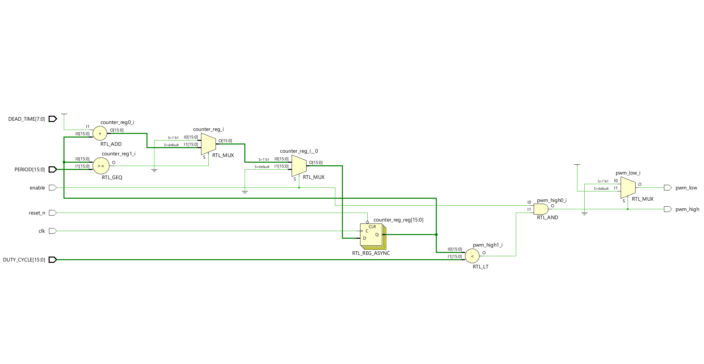
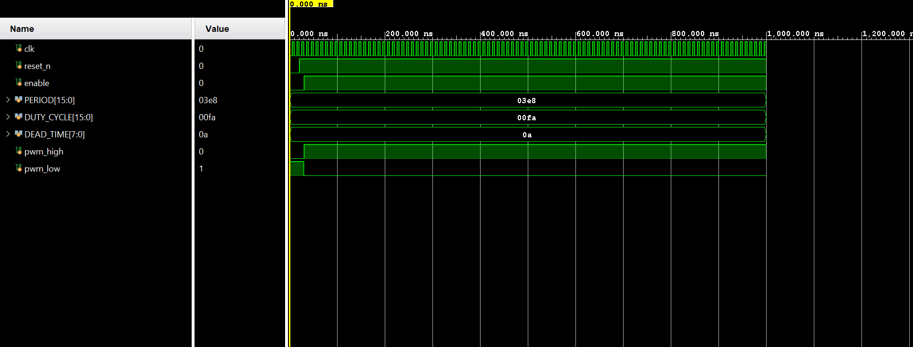
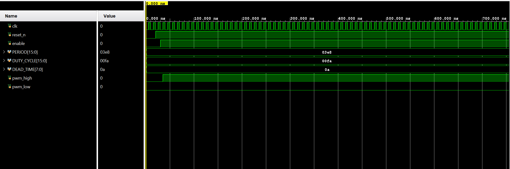

# Configurable PWM Generator with Dead-Time Control ⚡️

A configurable Pulse Width Modulation (PWM) generator IP core written in **SystemVerilog**. This module is designed for use in digital control systems for power electronics applications like motor drives, DC-DC converters, and inverters, where preventing signal overlap is critical.

This project was designed and verified using Vivado 2024.2.

---

## Key Features

-   **Configurable Frequency:** The PWM period is set via a 16-bit input `PERIOD`.
-   **Configurable Duty Cycle:** The on-time is set via a 16-bit input `DUTY_CYCLE`.
-   **Configurable Dead-Time:** Includes a crucial dead-time insertion feature to prevent shoot-through in half-bridge driver stages. The non-overlap period is set by an 8-bit `DEAD_TIME` input.
-   **Synchronous Design** with an active-low asynchronous reset.

---

## RTL Schematic

The following is the Register-Transfer Level (RTL) schematic synthesized by Vivado. It shows the core components of the design, including the main counter, comparators for the duty cycle and period, and the output logic.

*
RTL Schematic
*
****

---

## Verification & Simulation Results

The IP was verified using a self-checking testbench in SystemVerilog. The following waveforms demonstrate the correct behavior of the module in different scenarios.

### Case 1: Standard PWM Operation (No Dead-Time)

This waveform shows the basic functionality where `pwm_low` is the direct inverse of `pwm_high`.

*
Simulation Waveform without Dead-Time
*
****

### Case 2: PWM with Dead-Time Enabled

This waveform demonstrates the critical dead-time feature. Notice the small gap after `pwm_high` turns off and before `pwm_low` turns on, where both signals are low. This prevents shoot-through.

*
Simulation Waveform with Dead-Time
*
****

---

## How to Use

-   **`pwm_generator.v`**: The synthesizable SystemVerilog module.
-   **`testbench.v`**: The SystemVerilog testbench for simulation.

To simulate, set `pwm_generator.v` as a design source and `testbench.v` as a simulation source in an EDA tool like Vivado.
